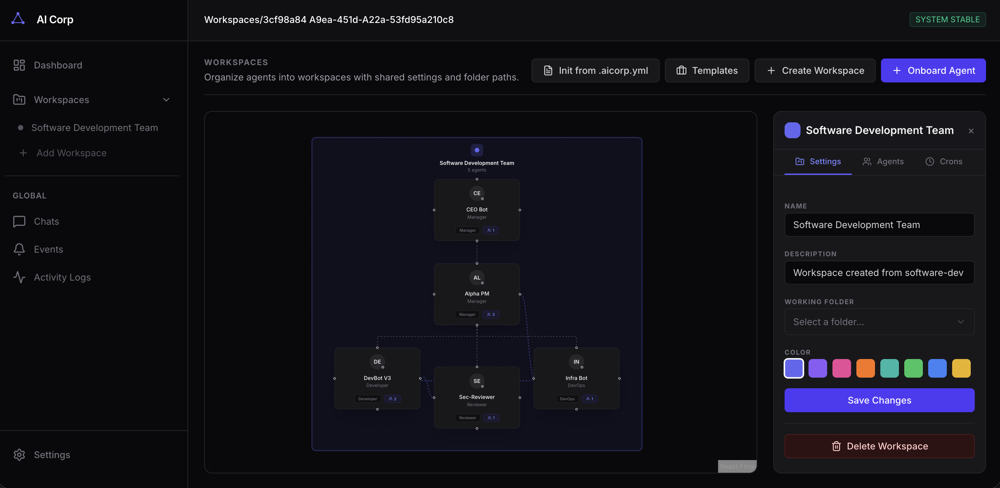

<div align="center">


# AI Corp - Experimental AI agent company dashboard
<p><strong>Experimental AI agent company dashboard</strong> for orchestrating workspace-scoped agents, tasks, roles, Telegram bots, cron jobs, and pipeline-style automation.</p>

<p>


</p>
</div>

> AI Corp is a living lab, not a polished product.
> Expect fast iteration, incomplete edges, and ideas that may shift as the project evolves.

## What This Is

AI Corp explores what a modern “AI company” interface can look like when agents are treated as first-class team members.

The project combines:
- workspace-scoped AI agents with roles, skills, and personalities
- Kanban-style task management
- inter-agent messaging and approvals
- Telegram bot integration
- cron-based automation
- command execution inside a Docker sandbox
- pipeline and event views for experimentation around agent workflows

## Why The README Framing Matters

This repo is intentionally presented as experimental because:
- the product direction is still being explored
- features may appear, change, or disappear quickly
- some flows are designed for internal iteration rather than polished onboarding
- the value is in the system design, not in pretending it is finished

If you want a concise mental model:

```text
Workspace = a company
Agents    = team members
Tasks     = work items
Roles     = permissions + behavior
Telegram  = external interface
Crons     = recurring automation
Pipelines = structured agent workflows
```

## Highlights

- Workspace creation and management
- AI agents with roles, skills, memory, and personality files
- Task board from Backlog to Done
- Direct agent-to-agent messaging
- Telegram bot support per agent
- Cron jobs for scheduled actions
- Role-based permissions for file, folder, and system access
- Command execution in a controlled Docker sandbox
- Pipeline and event views for more advanced orchestration experiments
- Workspace initialization from `.aicorp.yml`

## Stack

- Frontend: React 19, React Router 7, Zustand 5, Tailwind CSS v4
- Backend: Node.js, Express 4, TypeScript 5.8, tsx
- Data: JSON persistence in `~/.aicorp/` and SQLite-backed pieces where needed
- UI: Radix UI, Lucide React, motion animations
- Visualization: @xyflow/react, D3.js
- Automation: node-cron, Telegram bots, sandboxed command execution

## Quick Start

### Prerequisites

- Node.js
- Docker Desktop or Docker Engine

### Local Development

1. Install dependencies:
   ```bash
   npm install
   ```
2. Start the frontend:
   ```bash
   npm run dev
   ```
3. Start the backend:
   ```bash
   npm run dev:server
   ```

The app runs on:
- frontend: `http://localhost:3001`
- backend API: `http://localhost:4000`

## Docker Workflow

Use `make` if you want a more guided workflow:

```bash
make bootstrap
make start
make restart
make stop
make status
make logs
make logs-web
make logs-backend
```

This setup is useful when you want:
- the backend on the host for workspace path access
- the UI in Docker
- background agent managers running with the server

## Sandbox Command Execution

Agents can execute shell commands inside a Docker sandbox scoped to their workspace.

This experiment focuses on safe defaults:
- non-root container user
- workspace-only filesystem mount
- resource limits
- approval flow for risky commands
- optional network access control

Two permissions control this feature:
- `system:run_commands`
- `system:approve_commands`

## Workspace Settings

Each workspace can define:
- whether command execution is enabled
- Docker image to use
- CPU, memory, PID, and timeout limits
- network access policy
- destructive command policy
- Git write policy

## First-Time Setup

The first time you open a workspace:
- make sure Docker is running
- create or open a workspace with a valid `folderPath`
- let the system create the command sandbox automatically

If Docker is unavailable, command execution fails gracefully and the rest of the app still works.

## Development

```bash
npm run dev
npm run dev:server
npm run lint
npm test
```

## A Few Notes

- The project is optimized for experimentation and iteration, not production hardening.
- UX and data models may change as the experiment evolves.
- Some features are intentionally internal or opinionated to support rapid testing of agent workflows.

## Project Structure

```text
src/
  components/   UI and views
  lib/          shared client utilities
  server/       API, tools, automation, persistence
tests/          Vitest coverage for core logic
```
